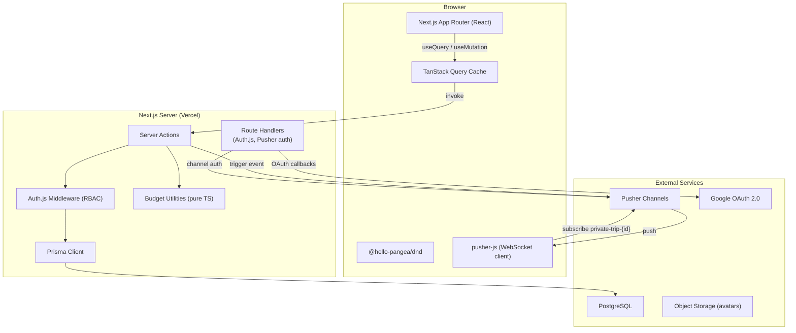

# Design Document

## Travel Planner SaaS

---

## Overview

Travel Planner SaaS is a collaborative trip-planning web application for solo travelers and group organizers, with a focus on Indonesian destinations. It lets users build day-by-day itineraries with drag-and-drop, track IDR-denominated expenses, split bills across group members with automatic settlement computation, and discover curated Indonesian places.

The system is a full-stack Next.js application using the App Router with TypeScript throughout. The backend is a PostgreSQL database accessed exclusively through Prisma ORM. Real-time collaboration for the trip dashboard is delivered via Pusher Channels (WebSocket pub/sub). Authentication is handled by Auth.js (NextAuth v5) with email/password credentials and Google OAuth 2.0.

**Key design decisions:**

| Decision | Choice | Rationale |
|---|---|---|
| Auth library | Auth.js v5 (NextAuth) | First-class App Router support, built-in Prisma adapter, supports Credentials and Google provider |
| Real-time | Pusher Channels | Serverless-compatible; Next.js on Vercel cannot hold persistent WebSocket connections natively at scale ([ably.com](https://ably.com/vercel/websockets-on-vercel)) |
| Drag-and-drop | `@hello-pangea/dnd` | Active fork of react-beautiful-dnd; simpler list-based API fits day-view itinerary ordering |
| Data fetching | Server Actions + TanStack Query | Server Actions for mutations; TanStack Query for client cache, optimistic updates, and stale-while-revalidate |
| Settlement algorithm | Greedy min-flow (net balance lists) | Produces ≤ N−1 settlements for N members with non-zero balances; O(N log N) |
| Currency storage | 64-bit signed integer (`bigint`) | All IDR amounts stored as whole integer units, eliminating floating-point rounding errors |

---

## Architecture

### High-Level Diagram



### Request Flow

1. **Client mutation** — user action triggers a TanStack Query mutation that calls a Server Action.
2. **Server Action** — Auth.js `auth()` validates the session; `withTripAccess` checks the TripMember role.
3. **Database write** — Prisma writes to PostgreSQL.
4. **Real-time trigger** — Server Action calls Pusher server SDK to push an event on `private-trip-{tripId}`.
5. **Live update** — All clients subscribed to that channel receive the event; TanStack Query invalidates the relevant cache key, triggering a refetch.

---

## Components and Interfaces

### Project Structure

```
src/
├── app/
│   ├── (auth)/
│   │   ├── login/page.tsx
│   │   └── register/page.tsx
│   ├── (app)/
│   │   ├── layout.tsx                    ← authenticated layout + session provider
│   │   ├── dashboard/page.tsx            ← trip list
│   │   └── trips/[tripId]/
│   │       ├── page.tsx                  ← TripDashboard
│   │       ├── itinerary/page.tsx
│   │       ├── expenses/page.tsx
│   │       └── members/page.tsx
│   ├── api/
│   │   ├── auth/[...nextauth]/route.ts   ← Auth.js handler
│   │   └── pusher/auth/route.ts          ← Pusher private-channel auth
│   └── layout.tsx
├── components/
│   ├── auth/
│   │   ├── LoginForm.tsx
│   │   └── RegisterForm.tsx
│   ├── trips/
│   │   ├── TripCard.tsx
│   │   ├── TripCreateDialog.tsx
│   │   └── TripEditDialog.tsx
│   ├── dashboard/
│   │   ├── TripDashboard.tsx             ← root dashboard, hosts Pusher hook
│   │   ├── DashboardHeader.tsx
│   │   ├── MemberList.tsx
│   │   ├── BudgetSummaryWidget.tsx
│   │   └── ConnectionStatusBanner.tsx
│   ├── itinerary/
│   │   ├── ItineraryPlanner.tsx          ← DragDropContext wrapper
│   │   ├── DayColumn.tsx                 ← Droppable per day
│   │   ├── ItineraryItemCard.tsx         ← Draggable item
│   │   └── ItineraryItemForm.tsx
│   ├── expenses/
│   │   ├── ExpenseList.tsx
│   │   ├── ExpenseLogForm.tsx
│   │   ├── SplitConfigPanel.tsx
│   │   └── SettlementSummary.tsx
│   ├── recommendations/
│   │   ├── PlaceSearchBar.tsx
│   │   ├── PlaceCard.tsx
│   │   └── PlaceCategoryBrowser.tsx
│   └── ui/                              ← Shadcn UI re-exports
├── lib/
│   ├── auth.ts                          ← Auth.js config
│   ├── prisma.ts                        ← Prisma singleton
│   ├── pusher.ts                        ← Pusher server-side singleton
│   ├── pusher-client.ts                 ← pusher-js browser singleton
│   ├── rate-limit.ts                    ← Redis-backed login rate limiter
│   └── budget/
│       ├── split.ts                     ← pure split utilities
│       ├── settlement.ts                ← pure settlement algorithm
│       └── analytics.ts                ← pure analytics aggregation
├── actions/
│   ├── auth.actions.ts
│   ├── trip.actions.ts
│   ├── itinerary.actions.ts
│   ├── expense.actions.ts
│   └── recommendation.actions.ts
├── hooks/
│   ├── useTripChannel.ts                ← Pusher subscription + connection state
│   ├── useItinerary.ts
│   └── useExpenses.ts
├── middleware.ts                        ← Auth.js session guard
└── prisma/
    ├── schema.prisma
    └── seed.ts
```

### Core Component Interfaces

```typescript
// TripDashboard — root orchestrator
interface TripDashboardProps {
  tripId: string;
  initialData: TripWithMembersAndSummary;
}
// Subscribes to private-trip-{tripId} via useTripChannel.
// Renders DashboardHeader, MemberList, BudgetSummaryWidget, ItineraryPlanner.
// Shows ConnectionStatusBanner when Pusher socket is unavailable.

// ItineraryPlanner — drag-and-drop orchestrator
interface ItineraryPlannerProps {
  tripId: string;
  dateRange: { start: Date; end: Date };
  role: 'Owner' | 'Editor' | 'Viewer';
}
// Wraps @hello-pangea/dnd <DragDropContext>.
// Renders one <DayColumn> per calendar day.
// onDragEnd calls reorderItineraryItemsAction.

// SplitConfigPanel — toggled within ExpenseLogForm
interface SplitConfigPanelProps {
  amount: bigint;
  members: TripMember[];
  value: SplitInput;
  onChange: (split: SplitInput) => void;
}
// Shows equal-split preview using computeEqualSplit from lib/budget/split.ts.
// Custom-split mode shows per-member amount inputs with live sum validation.

// SettlementSummary
interface SettlementSummaryProps {
  tripId: string;
}
// Calls computeSettlementsAction; displays Settlement tuples as readable cards.
```

---

## Data Models

### Prisma Schema

```prisma
// prisma/schema.prisma

generator client {
  provider = "prisma-client-js"
}

datasource db {
  provider = "postgresql"
  url      = env("DATABASE_URL")
}

// ─── Auth.js required models ───────────────────────────────────────────────

model User {
  id           String   @id @default(cuid())
  email        String   @unique
  passwordHash String?  // null for OAuth-only accounts
  displayName  String   @default("")
  avatarUrl    String?
  createdAt    DateTime @default(now())
  updatedAt    DateTime @updatedAt

  accounts    Account[]
  sessions    Session[]
  tripMembers TripMember[]

  @@index([email])
}

model Account {
  id                String  @id @default(cuid())
  userId            String
  type              String
  provider          String
  providerAccountId String
  refresh_token     String? @db.Text
  access_token      String? @db.Text
  expires_at        Int?
  token_type        String?
  scope             String?
  id_token          String? @db.Text
  session_state     String?

  user User @relation(fields: [userId], references: [id], onDelete: Cascade)

  @@unique([provider, providerAccountId])
}

model Session {
  id           String   @id @default(cuid())
  sessionToken String   @unique
  userId       String
  expires      DateTime

  user User @relation(fields: [userId], references: [id], onDelete: Cascade)
}

model VerificationToken {
  identifier String
  token      String   @unique
  expires    DateTime

  @@unique([identifier, token])
}

// ─── Trip models ───────────────────────────────────────────────────────────

enum TripType {
  Solo
  Group
}

model Trip {
  id              String    @id @default(cuid())
  destinationCity String    @db.VarChar(100)
  startDate       DateTime  @db.Date
  endDate         DateTime  @db.Date
  type            TripType
  budgetTarget    BigInt?   // IDR whole units; null until set
  createdAt       DateTime  @default(now())
  updatedAt       DateTime  @updatedAt

  members        TripMember[]
  itineraryItems ItineraryItem[]
  expenses       Expense[]

  @@index([startDate, endDate])
}

enum TripRole {
  Owner
  Editor
  Viewer
}

model TripMember {
  id        String   @id @default(cuid())
  tripId    String
  userId    String
  role      TripRole
  createdAt DateTime @default(now())

  trip Trip @relation(fields: [tripId], references: [id], onDelete: Cascade)
  user User @relation(fields: [userId], references: [id], onDelete: Restrict)

  expensesPaid  Expense[]      @relation("payer")
  expenseSplits ExpenseSplit[]

  @@unique([tripId, userId])
  @@index([tripId])
  @@index([userId])
}

model InvitationLink {
  id        String    @id @default(cuid())
  tripId    String
  role      TripRole  // Editor or Viewer only
  token     String    @unique @default(cuid())
  expiresAt DateTime
  usedAt    DateTime?
  createdAt DateTime  @default(now())

  @@index([token])
  @@index([tripId])
}

// ─── Itinerary models ──────────────────────────────────────────────────────

enum ItemCategory {
  Accommodation
  Transportation
  FoodBeverage   @map("Food & Beverage")
  Attraction
  Shopping
  Others
}

model ItineraryItem {
  id                String       @id @default(cuid())
  tripId            String
  date              DateTime     @db.Date
  placeName         String       @db.VarChar(100)
  address           String       @db.VarChar(255)
  category          ItemCategory
  notes             String?      @db.VarChar(1000)
  estimatedDuration Int          // minutes, 1–1440
  mapsUrl           String?
  sortIndex         Int          // reordering key, unique per (tripId, date)
  createdAt         DateTime     @default(now())
  updatedAt         DateTime     @updatedAt

  trip Trip @relation(fields: [tripId], references: [id], onDelete: Cascade)

  @@index([tripId, date, sortIndex])
}

// ─── Expense models ────────────────────────────────────────────────────────

enum ExpenseCategory {
  Accommodation
  Transportation
  FoodBeverage       @map("Food & Beverage")
  TicketsAttractions @map("Tickets/Attractions")
  Shopping
  Others
}

model Expense {
  id          String          @id @default(cuid())
  tripId      String
  payerId     String          // TripMember.id
  amount      BigInt          // IDR whole units, 1–999_999_999_999
  category    ExpenseCategory
  description String          @db.VarChar(255)
  date        DateTime        @db.Date
  createdAt   DateTime        @default(now())
  updatedAt   DateTime        @updatedAt

  trip   Trip       @relation(fields: [tripId], references: [id], onDelete: Cascade)
  payer  TripMember @relation("payer", fields: [payerId], references: [id], onDelete: Cascade)
  splits ExpenseSplit[]

  @@index([tripId])
  @@index([payerId])
}

model ExpenseSplit {
  id          String @id @default(cuid())
  expenseId   String
  memberId    String // TripMember.id
  shareAmount BigInt // IDR whole units

  expense Expense    @relation(fields: [expenseId], references: [id], onDelete: Cascade)
  member  TripMember @relation(fields: [memberId], references: [id], onDelete: Cascade)

  @@unique([expenseId, memberId])
  @@index([expenseId])
  @@index([memberId])
}

// ─── Recommendation model ──────────────────────────────────────────────────

enum PlaceCategory {
  Nature
  Culture
  Culinary
  Adventure
  Accommodation
  Entertainment
}

model Place {
  id          String        @id @default(cuid())
  name        String        @db.VarChar(100)
  city        String        @db.VarChar(100)
  province    String
  category    PlaceCategory
  description String        @db.VarChar(500)
  imageUrl    String?       @db.VarChar(2048)
  createdAt   DateTime      @default(now())

  @@index([name])
  @@index([city])
  @@index([category])
}
```

### Key TypeScript Types

```typescript
export type Settlement = {
  debtorMemberId: string;
  debtorName: string;
  creditorMemberId: string;
  creditorName: string;
  amount: bigint; // positive IDR integer > 0
};

export type NetBalance = {
  memberId: string;
  name: string;
  balance: bigint; // positive = owed money; negative = owes money
};

export type SplitInput =
  | { type: 'equal'; memberIds: string[] }
  | { type: 'custom'; shares: { memberId: string; amount: bigint }[] };

export type ReorderPayload = {
  tripId: string;
  date: string; // ISO date string YYYY-MM-DD
  orderedItemIds: string[]; // full ordered list after drag
};

export type ActionResult<T> =
  | { success: true; data: T }
  | { success: false; error: { code: string; message: string; fields?: Record<string, string> } };
```

---

## API Routes and Server Actions

### Authentication Routes

```
GET/POST  /api/auth/[...nextauth]   ← Auth.js handles all OAuth and session endpoints
POST      /api/pusher/auth          ← Pusher private-channel authentication
```

The Pusher auth endpoint validates the user session and verifies TripMember membership before issuing a channel auth signature. Channels named `private-trip-{tripId}` reject non-members with HTTP 403.

### Server Actions

All mutations are Server Actions (`'use server'`). RBAC is applied via a reusable `withTripAccess` guard.

#### Auth Actions (`actions/auth.actions.ts`)

| Action | Description |
|---|---|
| `registerAction(email, password)` | Validates email (RFC 5322), password length (8–128), bcrypt hashes at work factor 12, creates User |
| `loginAction(email, password)` | Checks rate limit, verifies credentials via Auth.js Credentials provider |

#### Trip Actions (`actions/trip.actions.ts`)

| Action | Required Role | Description |
|---|---|---|
| `createTripAction(input)` | Authenticated | Creates Trip; auto-assigns Owner TripMember |
| `updateTripAction(tripId, input)` | Owner \| Editor | Partial update; validates date range and ItineraryItem overlap |
| `deleteTripAction(tripId)` | Owner | Cascades via FK; returns confirmation |
| `getTripAction(tripId)` | TripMember | Returns Trip with members and budget summary |
| `generateInvitationAction(tripId, role)` | Owner \| Editor | Creates InvitationLink valid for 7 days |
| `acceptInvitationAction(token)` | Authenticated | Validates expiry and used-status; creates TripMember |
| `changeMemberRoleAction(tripId, memberId, newRole)` | Owner | Enforces single-Owner constraint |

#### Itinerary Actions (`actions/itinerary.actions.ts`)

| Action | Required Role | Description |
|---|---|---|
| `createItineraryItemAction(tripId, input)` | Owner \| Editor | Validates date in trip range, duration 1–1440, field lengths |
| `updateItineraryItemAction(itemId, input)` | Owner \| Editor | Partial field update |
| `deleteItineraryItemAction(itemId)` | Owner \| Editor | Returns updated ordered day list |
| `reorderItineraryItemsAction(payload)` | Owner \| Editor | Atomic reindex within day using PostgreSQL advisory lock; triggers Pusher `itinerary:reordered` |

#### Expense Actions (`actions/expense.actions.ts`)

| Action | Required Role | Description |
|---|---|---|
| `logExpenseAction(tripId, input, split)` | TripMember | Creates Expense + ExpenseSplit records; recalculates total spent |
| `deleteExpenseAction(expenseId)` | Owner \| Editor | Removes Expense and ExpenseSplits; recalculates total |
| `computeSettlementsAction(tripId)` | TripMember | Calls `computeSettlements()` utility; returns Settlement[] |
| `getBudgetSummaryAction(tripId)` | TripMember | Returns target, spent, remaining in IDR |
| `setBudgetTargetAction(tripId, amount)` | Owner \| Editor | Validates range (1–999,999,999,999); persists budgetTarget |
| `getAnalyticsAction(tripId)` | TripMember | Per-category breakdown |

#### Recommendation Actions (`actions/recommendation.actions.ts`)

| Action | Description |
|---|---|
| `searchPlacesAction(query)` | Validates 2–100 chars; case-insensitive name/city search; ≤50 results sorted by name |
| `browseByCategory(category)` | Validates category enum value; ≤50 results sorted by name |

### RBAC Guard Pattern

```typescript
// lib/rbac.ts
export async function withTripAccess<T>(
  tripId: string,
  requiredRoles: TripRole[],
  fn: (member: TripMember) => Promise<T>
): Promise<T> {
  const session = await auth();
  if (!session?.user?.id) throw new AppError('UNAUTHORIZED', 'Not authenticated');

  const member = await prisma.tripMember.findUnique({
    where: { tripId_userId: { tripId, userId: session.user.id } },
  });
  // 404 (not 403) when not a member — avoids trip existence disclosure (Req 16.3)
  if (!member) throw new AppError('NOT_FOUND', 'Trip not found');
  if (!requiredRoles.includes(member.role))
    throw new AppError('FORBIDDEN', 'Insufficient permissions');

  return fn(member);
}
```

---

## Budget Calculation Utility Design

All financial arithmetic is in pure TypeScript functions under `lib/budget/`. They operate on `bigint` exclusively and have no side effects, making them deterministically property-testable.

### `lib/budget/split.ts`

```typescript
/**
 * Computes equal split shares for an expense amount across N members.
 * Remainder (amount % BigInt(N)) is assigned to the first member.
 *
 * Preconditions:
 *   - amount in [1n, 999_999_999_999n]
 *   - memberIds.length in [2, 50]
 *
 * Postcondition: sum of all returned share values === amount
 */
export function computeEqualSplit(
  amount: bigint,
  memberIds: string[]
): Map<string, bigint>;

/**
 * Validates a custom split: sum of provided shares must equal amount.
 * Returns the validated map on success.
 * Throws SplitValidationError with field details on mismatch.
 *
 * Postcondition: sum of returned share values === amount (or throws)
 */
export function validateCustomSplit(
  amount: bigint,
  shares: { memberId: string; amount: bigint }[]
): Map<string, bigint>;
```

### `lib/budget/settlement.ts`

The algorithm uses a greedy minimum-flow approach:

1. Compute each member's **net balance**: `balance = Σ(amounts_paid) − Σ(shares_owed)`.
2. Verify `Σ(all balances) === 0n` (zero-sum invariant).
3. Partition into **creditors** (balance > 0) and **debtors** (balance < 0). Sort both by absolute value descending.
4. Two-pointer greedy: match the largest debtor to the largest creditor. Create a Settlement for `min(|debtor|, creditor)`. Zero out the exhausted party and advance its pointer.
5. Result has at most N−1 settlements for N members with non-zero balances.

```typescript
/**
 * Computes the minimum settlement list from net member balances.
 *
 * Precondition:  Σ balance === 0n for all members
 * Postconditions:
 *   - Every Settlement has amount > 0n
 *   - After applying all Settlements, every member balance === 0n
 *   - settlements.length <= nonZeroMembers - 1
 */
export function computeSettlements(balances: NetBalance[]): Settlement[];

/**
 * Computes net balances for all members of a trip from raw expense+split data.
 * Pure function — accepts arrays, returns computed balances.
 */
export function computeNetBalances(
  members: { id: string; name: string }[],
  expenses: { payerId: string; splits: { memberId: string; shareAmount: bigint }[] }[]
): NetBalance[];
```

### `lib/budget/analytics.ts`

```typescript
export type BudgetAnalytics = {
  totalTarget: bigint;
  totalSpent: bigint;
  remaining: bigint;           // totalTarget - totalSpent; negative = over budget
  byCategory: Record<ExpenseCategory, { spent: bigint }>;
};

/**
 * Computes budget analytics from expenses and a target budget.
 * Pure function — no I/O.
 *
 * Postcondition: remaining === totalTarget - totalSpent
 * Postcondition: Σ(byCategory[c].spent) === totalSpent
 */
export function computeAnalytics(
  expenses: { category: ExpenseCategory; amount: bigint }[],
  budgetTarget: bigint | null
): BudgetAnalytics;
```

---

## Real-Time Synchronization Strategy

### Transport Layer

[Pusher Channels](https://pusher.com/channels) provides a managed WebSocket pub/sub layer compatible with Vercel serverless. Server Actions trigger events on the Pusher server SDK after each successful write. Clients subscribe via `pusher-js`.

### Channel Naming and Security

All channels use the naming convention `private-trip-{tripId}`. Private channels require client authentication through `POST /api/pusher/auth`, which verifies the user's session and confirms TripMember status before signing the auth response.

### Event Catalogue

| Event | Payload | Triggering Action |
|---|---|---|
| `itinerary:item-created` | `ItineraryItem` | `createItineraryItemAction` |
| `itinerary:item-updated` | `ItineraryItem` | `updateItineraryItemAction` |
| `itinerary:item-deleted` | `{ itemId, date }` | `deleteItineraryItemAction` |
| `itinerary:reordered` | `{ date, orderedItemIds }` | `reorderItineraryItemsAction` |
| `expense:created` | `{ expenseId, totalSpent }` | `logExpenseAction` |
| `expense:deleted` | `{ expenseId, totalSpent }` | `deleteExpenseAction` |
| `member:role-changed` | `{ memberId, newRole }` | `changeMemberRoleAction` |
| `budget:target-updated` | `{ budgetTarget }` | `setBudgetTargetAction` |

### Client Hook

```typescript
// hooks/useTripChannel.ts
export function useTripChannel(tripId: string) {
  const queryClient = useQueryClient();
  const [connected, setConnected] = useState(true);

  useEffect(() => {
    const channel = pusherClient.subscribe(`private-trip-${tripId}`);

    channel.bind('itinerary:reordered', () => {
      queryClient.invalidateQueries({ queryKey: ['itinerary', tripId] });
    });
    channel.bind('expense:created', () => {
      queryClient.invalidateQueries({ queryKey: ['expenses', tripId] });
      queryClient.invalidateQueries({ queryKey: ['budget', tripId] });
    });
    // ... bind remaining events

    pusherClient.connection.bind('unavailable', () => setConnected(false));
    pusherClient.connection.bind('connected', () => setConnected(true));

    return () => pusherClient.unsubscribe(`private-trip-${tripId}`);
  }, [tripId, queryClient]);

  return { connected };
}
```

### Concurrent Reorder Serialization

Concurrent reorder operations on the same day are serialized using a PostgreSQL advisory lock keyed on `hashtext(tripId || date)`. The Server Action acquires the lock, reads current order, applies the requested position change, re-assigns contiguous `sortIndex` values for all items in the day within a transaction, then releases the lock. Each submitting client receives the authoritative order via `itinerary:reordered` and reconciles its local optimistic state.

---

## Authentication Design

### Auth.js v5 Configuration (`lib/auth.ts`)

```typescript
import NextAuth from 'next-auth';
import { PrismaAdapter } from '@auth/prisma-adapter';
import Credentials from 'next-auth/providers/credentials';
import Google from 'next-auth/providers/google';
import bcrypt from 'bcryptjs';
import { prisma } from '@/lib/prisma';
import { checkLoginRateLimit, recordFailedAttempt, resetAttempts } from '@/lib/rate-limit';

export const { handlers, auth, signIn, signOut } = NextAuth({
  adapter: PrismaAdapter(prisma),
  session: { strategy: 'jwt', maxAge: 24 * 60 * 60 }, // 24-hour token
  providers: [
    Google({
      clientId: process.env.GOOGLE_CLIENT_ID!,
      clientSecret: process.env.GOOGLE_CLIENT_SECRET!,
    }),
    Credentials({
      credentials: {
        email: { type: 'email' },
        password: { type: 'password' },
        ip: { type: 'text' },  // forwarded from Server Action
      },
      async authorize(credentials) {
        const ip = credentials.ip as string;
        await checkLoginRateLimit(ip); // throws if blocked

        const user = await prisma.user.findUnique({
          where: { email: credentials.email as string },
          select: { id: true, email: true, passwordHash: true, displayName: true },
        });
        const valid = user?.passwordHash &&
          await bcrypt.compare(credentials.password as string, user.passwordHash);

        if (!valid) {
          await recordFailedAttempt(ip);
          return null;
        }
        await resetAttempts(ip);
        return user;
      },
    }),
  ],
  callbacks: {
    jwt({ token, user }) {
      if (user) token.id = user.id;
      return token;
    },
    session({ session, token }) {
      session.user.id = token.id as string;
      return session;
    },
  },
});
```

### Rate Limiting

Login rate limiting (5 failed attempts / IP / 10 min → 15 min block) is implemented in `lib/rate-limit.ts` backed by Redis (Upstash recommended for Vercel). The IP is extracted in the Server Action from the request headers and passed to the `authorize` function.

### Password Hashing

Passwords hashed with `bcryptjs` at work factor 12. The `passwordHash` field is `null` for OAuth-only accounts, allowing future credential linking without schema changes.

### Route Protection (`middleware.ts`)

```typescript
import { auth } from '@/lib/auth';

export default auth((req) => {
  const isPublic = req.nextUrl.pathname.startsWith('/login') ||
                   req.nextUrl.pathname.startsWith('/register') ||
                   req.nextUrl.pathname.startsWith('/api/auth');
  if (!req.auth && !isPublic) {
    return Response.redirect(new URL('/login', req.url));
  }
});

export const config = {
  matcher: ['/((?!_next/static|_next/image|favicon.ico).*)'],
};
```

---

## Role-Based Access Control

RBAC is enforced at the Server Action layer (not only the UI) via `withTripAccess`. The permission matrix:

| Operation | Owner | Editor | Viewer | Non-member |
|---|---|---|---|---|
| Read trip / itinerary / expenses | ✅ | ✅ | ✅ | 404 |
| Create/update/delete itinerary items | ✅ | ✅ | 403 | 404 |
| Log / delete expenses | ✅ | ✅ | 403 | 404 |
| Set budget target | ✅ | ✅ | 403 | 404 |
| Update trip metadata | ✅ | ✅ | 403 | 404 |
| Delete trip | ✅ | 403 | 403 | 404 |
| Generate invitation link | ✅ | ✅ | 403 | 404 |
| Change member role | ✅ | 403 | 403 | 404 |

Non-member requests return 404 (not 403) to avoid disclosing trip existence (Requirement 16.3).

---

## Place Recommendation Module Design

### Data Source

The `Place` table is a curated, seeded dataset populated via `prisma/seed.ts` from a static JSON file of Indonesian places. It is not user-editable.

### Search Implementation

```typescript
// actions/recommendation.actions.ts
export async function searchPlacesAction(query: string): Promise<ActionResult<Place[]>> {
  if (query.length < 2) return { success: false, error: { code: 'VALIDATION', message: 'Query must be at least 2 characters' } };
  if (query.length > 100) return { success: false, error: { code: 'VALIDATION', message: 'Query must not exceed 100 characters' } };

  const places = await prisma.place.findMany({
    where: {
      OR: [
        { name: { contains: query, mode: 'insensitive' } },
        { city: { contains: query, mode: 'insensitive' } },
      ],
    },
    orderBy: { name: 'asc' },
    take: 50,
  });
  return { success: true, data: places };
}
```

PostgreSQL `ILIKE` (via Prisma's `mode: 'insensitive'`) supports case-insensitive containment. For datasets up to 10,000 records, `pg_trgm` GIN indexes on `name` and `city` ensure sub-second response times (Requirement 14.9).

```sql
-- Added via Prisma migration extension
CREATE EXTENSION IF NOT EXISTS pg_trgm;
CREATE INDEX place_name_trgm ON "Place" USING GIN (name gin_trgm_ops);
CREATE INDEX place_city_trgm ON "Place" USING GIN (city gin_trgm_ops);
```

### "Add to Itinerary" Flow

Selecting "Add to Itinerary" on a `PlaceCard` navigates to the itinerary page with place data encoded as URL search params:

```
/trips/{tripId}/itinerary?prefill=1&placeName=...&address=...&category=...
```

`ItineraryItemForm` reads these params on mount and pre-populates the form fields before the user completes the entry.

---

## Error Handling

### Error Taxonomy

```typescript
export class AppError extends Error {
  constructor(
    public code:
      | 'UNAUTHORIZED'        // 401 — missing/expired session
      | 'FORBIDDEN'           // 403 — insufficient role
      | 'NOT_FOUND'           // 404 — resource not found or non-member access
      | 'VALIDATION'          // 422 — input validation failure
      | 'CONFLICT'            // 409 — duplicate (email, membership)
      | 'SERVICE_UNAVAILABLE', // 503 — external service unavailable
    message: string,
    public fields?: Record<string, string> // per-field validation details
  ) { super(message); }
}
```

### Server Action Response Convention

Server Actions return a discriminated union rather than throwing across the server/client boundary:

```typescript
export type ActionResult<T> =
  | { success: true; data: T }
  | { success: false; error: { code: string; message: string; fields?: Record<string, string> } };
```

TanStack Query `onError` handlers display user-facing messages via Shadcn `Sonner` toasts. Field-level errors (`fields`) are mapped to form field states by `react-hook-form`.

---

## Correctness Properties

*A property is a characteristic or behavior that should hold true across all valid executions of a system — essentially, a formal statement about what the system should do. Properties serve as the bridge between human-readable specifications and machine-verifiable correctness guarantees.*

Tests are implemented using [fast-check](https://fast-check.dev/) (TypeScript). Each test runs a minimum of 100 iterations. Pure utility functions in `lib/budget/` are the primary targets; they have no I/O and are ideal for PBT.

---

### Property 1: Equal-split shares are lossless

*For any* expense amount A in [1, 999,999,999,999] and any list of N members in [2, 50], the sum of all shares computed by `computeEqualSplit` SHALL equal A exactly.

**Validates: Requirements 12.2, 15.6**

---

### Property 2: Custom-split round-trip

*For any* custom split where the sum of provided shares equals the total expense amount, `validateCustomSplit` SHALL return the provided shares unchanged. *For any* custom split where the sum of shares does not equal the total, `validateCustomSplit` SHALL throw a `SplitValidationError` and never return partial data.

**Validates: Requirements 12.3**

---

### Property 3: Settlement zero-sum and completeness

*For any* set of expense records with splits for a trip, the sum of all member net balances as computed by `computeNetBalances` SHALL equal 0. After applying all settlements returned by `computeSettlements`, every member's net balance SHALL equal 0.

**Validates: Requirements 12.4, 12.5, 12.6**

---

### Property 4: Settlement minimality

*For any* set of members with non-zero balances, the number of settlements returned by `computeSettlements` SHALL be less than or equal to N−1, where N is the count of members with a non-zero balance.

**Validates: Requirements 12.4**

---

### Property 5: Settlement idempotence

*For any* set of expense records, calling `computeSettlements` twice on the same net-balance inputs SHALL produce an equivalent settlement list (same debtor, creditor, and amount tuples, possibly in different order).

**Validates: Requirements 12.6**

---

### Property 6: Budget remaining arithmetic invariant

*For any* budget target T in [1, 999,999,999,999] and any list of expenses with amounts in [1, 999,999,999,999], the remaining budget computed by `computeAnalytics` SHALL equal T − Σ(expense amounts). The result SHALL be representable as a 64-bit signed integer (bigint) without overflow.

**Validates: Requirements 7.3, 10.4, 13.3, 15.6**

---

### Property 7: Itinerary reorder permutation invariant

*For any* list of ItineraryItems in a day and any valid reorder operation (moving an item to a new position), the set of ItineraryItem IDs after the reorder SHALL be identical to the set before the reorder, and the resulting sortIndex values SHALL form a strictly increasing sequence with no duplicates.

**Validates: Requirements 9.1, 9.2, 9.4**

---

### Property 8: Place search subset invariant

*For any* valid search query Q (length 2–100), every Place returned by `searchPlacesAction` SHALL contain Q in its `name` or `city` field (case-insensitive). No Place lacking Q in both fields SHALL appear in the results.

**Validates: Requirements 14.2**

---

### Property 9: Place category filter invariant

*For any* valid category C, every Place returned by `browseByCategory` SHALL have `category === C`. No Place with a different category SHALL appear in the results.

**Validates: Requirements 14.5**

---

### Property 10: Search monotonicity

*For any* query Q that is a strict prefix of query Q', the result set of Q SHALL be a superset of (or equal to) the result set of Q'. Longer, more specific queries produce equal or fewer results.

**Validates: Requirements 14.9**

---

### Property 11: Monetary integer no-overflow

*For any* set of up to 1,000 expenses each with an amount in [1, 999,999,999,999], all arithmetic operations (sum for total spent, net balance computation, settlement amounts) SHALL be representable as 64-bit signed bigint values without overflow. The maximum representable value is 9,223,372,036,854,775,807, which exceeds 1,000 × 999,999,999,999 = 999,999,999,999,000 comfortably.

**Validates: Requirements 15.6**

---

### Property 12: Single Owner invariant

*For any* role change operation on a Trip, the resulting TripMember list SHALL contain exactly one member with the `Owner` role. Any role change that would produce zero Owners or more than one Owner SHALL be rejected with a validation error.

**Validates: Requirements 6.9**

---

### Property 13: Trip date validation boundary

*For any* trip creation or update request where startDate > endDate, the operation SHALL be rejected with a validation error and no Trip record SHALL be created or modified. *For any* request where the duration (endDate − startDate + 1) exceeds 365 days, the same rejection SHALL occur.

**Validates: Requirements 4.3, 5.7**

---

### Property 14: Display name round-trip

*For any* display name string D of length in [1, 64], calling `updateProfile(D)` followed by `getProfile()` SHALL return D unchanged. *For any* string of length 0 or length > 64, the update SHALL be rejected with a validation error and the stored display name SHALL be unchanged.

**Validates: Requirements 3.3, 3.4**

---

## Testing Strategy

### Dual Testing Approach

**Unit tests (Vitest)** cover specific examples, edge cases, and integration points:
- Auth registration/login flows with concrete valid and invalid inputs
- RBAC guard behavior for each role/operation combination
- Invitation link expiry and used-link rejection
- Itinerary item validation (duration bounds, date range, field length)
- Expense category validation

**Property-based tests (fast-check, minimum 100 iterations per property)** cover universally quantified properties of pure functions:
- All 14 properties listed above
- Each test is tagged with a comment: `// Feature: travel-planner-saas, Property N: <property text>`

### Test Organization

```
tests/
├── unit/
│   ├── auth/
│   │   ├── register.test.ts
│   │   └── login.test.ts
│   ├── trips/
│   │   ├── create.test.ts
│   │   └── rbac.test.ts
│   └── itinerary/
│       └── validation.test.ts
└── property/
    ├── budget/
    │   ├── split.property.test.ts        ← Properties 1–2
    │   ├── settlement.property.test.ts   ← Properties 3–5
    │   └── analytics.property.test.ts   ← Property 6
    ├── itinerary/
    │   └── reorder.property.test.ts      ← Property 7
    ├── recommendations/
    │   └── search.property.test.ts       ← Properties 8–10
    └── data-integrity/
        ├── monetary.property.test.ts     ← Property 11
        ├── owner-invariant.property.test.ts ← Property 12
        ├── date-validation.property.test.ts  ← Property 13
        └── profile.property.test.ts      ← Property 14
```

### Property Test Configuration (fast-check)

```typescript
// Example: Property 1 — Equal-split lossless
import fc from 'fast-check';
import { computeEqualSplit } from '@/lib/budget/split';

// Feature: travel-planner-saas, Property 1: Equal-split shares are lossless
it('sum of equal split shares equals original amount', () => {
  fc.assert(
    fc.property(
      fc.bigInt({ min: 1n, max: 999_999_999_999n }),
      fc.array(fc.uuid(), { minLength: 2, maxLength: 50 }),
      (amount, memberIds) => {
        const shares = computeEqualSplit(amount, memberIds);
        const total = [...shares.values()].reduce((a, b) => a + b, 0n);
        return total === amount;
      }
    ),
    { numRuns: 200 }
  );
});
```

### Integration Tests

Integration tests (using Vitest + a test PostgreSQL database) verify:
- Full expense-log → split → settlement workflow end-to-end
- Cascade deletes (Trip deletion removes all associated records)
- Concurrent reorder serialization (two simultaneous reorders on same day produce consistent result)
- Real-time event publishing (Pusher trigger called after each mutation)
- Google OAuth mock-provider flow (account creation and existing-account login)
